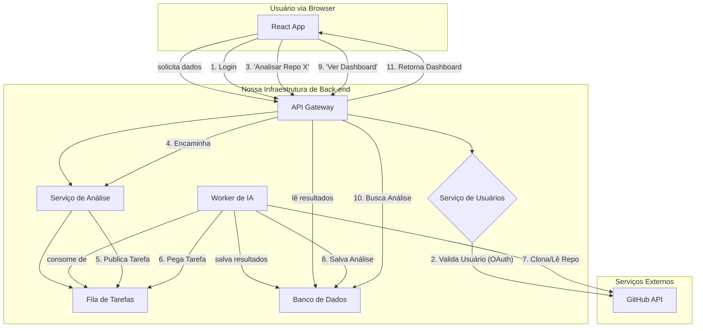

# 📄 Domínio: Arquitetura do Sistema

Esta é a arquitetura de sistema planejada para o `RepoAnalyst`. Ela foi projetada para ser escalável e desacoplada, separando a interface do usuário, o processamento de back-end e os trabalhos de análise pesada.

## Componentes Principais

1.  **Frontend (React App)**: Um Single Page Application (SPA) que consome nossa API. Será hospedado estaticamente (ex: Vercel ou Azure Static Web Apps).
2.  **API Gateway (Node.js/Express)**: O ponto de entrada único para o front-end. Gerencia autenticação (JWTs) e roteia solicitações para os microserviços apropriados.
3.  **Serviço de Usuários (Python/FastAPI)**: Gerencia o login, perfis e quais repositórios um usuário "possui".
4.  **Serviço de Análise (Python/FastAPI)**: Recebe solicitações para analisar um repositório.
5.  **Fila de Trabalhos (RabbitMQ/Redis)**: A análise de um repositório é demorada. A API de Análise não fará o trabalho; ela publicará uma "tarefa" na fila.
6.  **Workers de IA (Python/Celery)**: Um grupo de "trabalhadores" que escutam a fila. Quando uma tarefa (ex: "Analisar repo X") aparece, um worker a pega, clona o repositório, executa os modelos de IA (ex: análise de complexidade, detecção de "code smells") e salva o resultado no Banco de Dados.
7.  **Banco de Dados (PostgreSQL)**: Armazena os dados dos usuários e os *resultados* das análises.

## Diagrama de Fluxo de Dados (Mermaid)

Este diagrama (renderizado nativamente no GitHub) mostra o fluxo de uma solicitação de análise:

