# 📄 Domínio: Arquitetura do Sistema

Esta é a arquitetura de sistema planejada para o `RepoAnalyst`. Ela foi projetada para ser escalável e desacoplada, separando a interface do usuário, o processamento de back-end e os trabalhos de análise pesada.

## Componentes Principais

1.  **Frontend (React App)**: Um Single Page Application (SPA) que consome nossa API. Será hospedado estaticamente (ex: Vercel ou Azure Static Web Apps).
2.  **API Gateway (Node.js/Express)**: O ponto de entrada único para o front-end. Gerencia autenticação (JWTs) e roteia solicitações para os microserviços apropriados.
3.  **Serviço de Usuários (Python/FastAPI)**: Gerencia o login, perfis e quais repositórios um usuário "possui".
4.  **Serviço de Análise (Python/FastAPI)**: Recebe solicitações para analisar um repositório.
5.  **Fila de Trabalhos (RabbitMQ/Redis)**: A análise de um repositório é demorada. A API de Análise não fará o trabalho; ela publicará uma "tarefa" na fila.
6.  **Workers de IA (Python/Celery)**: Um grupo de "trabalhadores" que escutam a fila. Quando uma tarefa (ex: "Analisar repo X") aparece, um worker a pega, clona o repositório, executa os modelos de IA (ex: análise de complexidade, detecção de "code smells") e salva o resultado no Banco de Dados.
7.  **Banco de Dados (PostgreSQL)**: Armazena os dados dos usuários e os *resultados* das análises.

## Diagrama de Fluxo de Dados (Mermaid)

Este diagrama (renderizado nativamente no GitHub) mostra o fluxo de uma solicitação de análise:

```mermaid
graph TD
    subgraph "Usuário via Browser"
        A[React App]
    end

    subgraph "Nossa Infraestrutura de Back-end"
        B[API Gateway] --> C{Serviço de Usuários}
        B --> D[Serviço de Análise]
        D --> E[Fila de Tarefas]
        F[Worker de IA] -- consome de --> E
        F -- salva resultados --> G[Banco de Dados]
        A -- solicita dados --> B
        B -- lê resultados --> G
    end

    subgraph "Serviços Externos"
        H[GitHub API]
    end

    A -- "1. Login" --> B
    C -- "2. Valida Usuário (OAuth)" --> H
    A -- "3. 'Analisar Repo X'" --> B
    B -- "4. Encaminha" --> D
    D -- "5. Publica Tarefa" --> E
    F -- "6. Pega Tarefa" --> E
    F -- "7. Clona/Lê Repo" --> H
    F -- "8. Salva Análise" --> G
    A -- "9. 'Ver Dashboard'" --> B
    B -- "10. Busca Análise" --> G
    B -- "11. Retorna Dashboard" --> A
```

