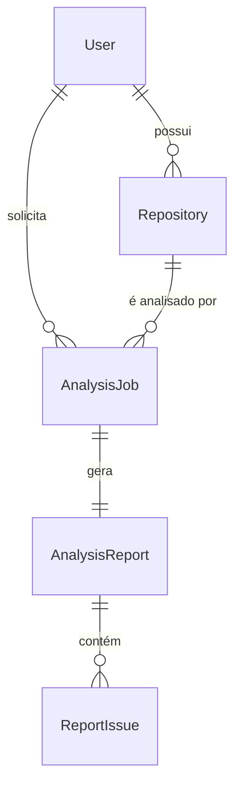

# 🧊 Domínio: Modelos de Dados

Este documento define a estrutura de dados planejada para o banco de dados PostgreSQL. Estas são as entidades centrais que o `RepoAnalyst` irá gerenciar.

## Entidades Principais

### 1. User
Armazena os usuários que se autenticaram via GitHub.

| Coluna | Tipo | Chave | Notas |
| :--- | :--- | :--- | :--- |
| `user_id` | `UUID` | **PK** | Chave primária interna. |
| `github_id` | `INTEGER` | **Unique** | ID numérico do usuário no GitHub. |
| `username` | `TEXT` | **Unique** | Nome de usuário do GitHub (ex: "octocat"). |
| `email` | `TEXT` | | E-mail principal (pode ser nulo). |
| `created_at` | `TIMESTAMPZ`| | Data de registro. |

### 2. Repository
Armazena os repositórios que nossos usuários "vincularam" ao sistema.

| Coluna | Tipo | Chave | Notas |
| :--- | :--- | :--- | :--- |
| `repo_id` | `UUID` | **PK** | Chave primária interna. |
| `github_repo_id` | `INTEGER` | **Unique** | ID numérico do repositório no GitHub. |
| `full_name` | `TEXT` | **Index** | Nome completo (ex: "usuario/meu-repo"). |
| `owner_user_id` | `UUID` | **FK (User)** | Quem "importou" este repo para o sistema. |

### 3. AnalysisJob
Registra a *solicitação* de uma análise. Atua como um rastreador de trabalho.

| Coluna | Tipo | Chave | Notas |
| :--- | :--- | :--- | :--- |
| `job_id` | `UUID` | **PK** | Chave primária do trabalho. |
| `repo_id` | `UUID` | **FK (Repo)** | Repositório a ser analisado. |
| `requester_user_id` | `UUID` | **FK (User)** | Usuário que solicitou a análise. |
| `status` | `TEXT` | **Index** | 'pending', 'processing', 'completed', 'failed' |
| `created_at` | `TIMESTAMPZ` | | Quando foi solicitado. |
| `completed_at` | `TIMESTAMPZ` | | Quando foi concluído (ou falhou). |

### 4. AnalysisReport
Armazena o *resultado* de um `AnalysisJob` bem-sucedido.

| Coluna | Tipo | Chave | Notas |
| :--- | :--- | :--- | :--- |
| `report_id` | `UUID` | **PK** | Chave primária do relatório. |
| `job_id` | `UUID` | **FK (Job)** | O trabalho que gerou este relatório. |
| `quality_score` | `INTEGER` | | Pontuação geral (0-100). |
| `metrics_data` | `JSONB` | | Armazena dados flexíveis (complexidade, etc). |
| `generated_at` | `TIMESTAMPZ` | | Data de geração. |

### 5. ReportIssue
Uma sub-tabela que armazena os "hotspots" ou problemas encontrados.

| Coluna | Tipo | Chave | Notas |
| :--- | :--- | :--- | :--- |
| `issue_id` | `UUID` | **PK** | Chave primária do problema. |
| `report_id` | `UUID` | **FK (Report)**| Relatório ao qual este problema pertence. |
| `file_path` | `TEXT` | | Ex: "src/utils/helpers.py" |
| `line_number` | `INTEGER` | | Linha do problema. |
| `issue_type` | `TEXT` | | Ex: "Complexidade Alta", "Code Smell" |
| `description` | `TEXT` | | Mensagem explicando o problema. |

## Diagrama de Entidade-Relacionamento (ERD - Mermaid)

